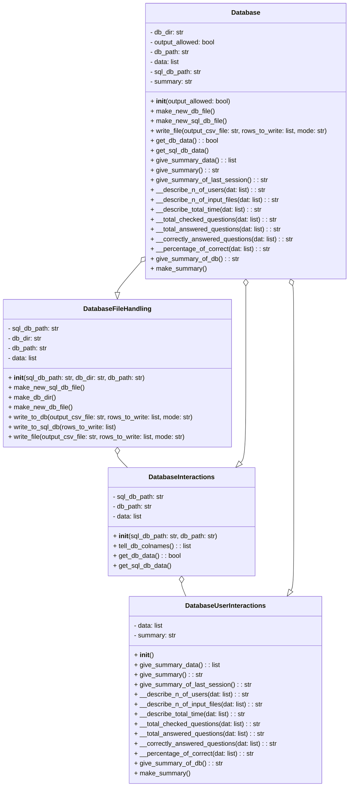

```mermaid
classDiagram
    class DatabaseFileHandling{
        - sql_db_path: str
        - db_dir: str
        - db_path: str
        - data: list

        + __init__(sql_db_path: str, db_dir: str, db_path: str)
        + make_new_sql_db_file()
        + make_db_dir()
        + make_new_db_file()
        + write_to_db(output_csv_file: str, rows_to_write: list, mode: str)
        + write_to_sql_db(rows_to_write: list)
        + write_file(output_csv_file: str, rows_to_write: list, mode: str)
    }
    class DatabaseInteractions{
        - sql_db_path: str
        - db_path: str
        - data: list

        + __init__(sql_db_path: str, db_path: str)
        + tell_db_colnames(): list
        + get_db_data(): bool
        + get_sql_db_data()
    }
    class DatabaseUserInteractions{
        - data: list
        - summary: str

        + __init__()
        + give_summary_data(): list
        + give_summary(): str
        + give_summary_of_last_session(): str
        + __describe_n_of_users(dat: list): str
        + __describe_n_of_input_files(dat: list): str
        + __describe_total_time(dat: list): str
        + __total_checked_questions(dat: list): str
        + __total_answered_questions(dat: list): str
        + __correctly_answered_questions(dat: list): str
        + __percentage_of_correct(dat: list): str
        + give_summary_of_db(): str
        + make_summary()
    }
    class Database{
        - db_dir: str
        - output_allowed: bool
        - db_path: str
        - data: list
        - sql_db_path: str
        - summary: str

        + __init__(output_allowed: bool)
        + make_new_db_file()
        + make_new_sql_db_file()
        + write_file(output_csv_file: str, rows_to_write: list, mode: str)
        + get_db_data(): bool
        + get_sql_db_data()
        + give_summary_data(): list
        + give_summary(): str
        + give_summary_of_last_session(): str
        + __describe_n_of_users(dat: list): str
        + __describe_n_of_input_files(dat: list): str
        + __describe_total_time(dat: list): str
        + __total_checked_questions(dat: list): str
        + __total_answered_questions(dat: list): str
        + __correctly_answered_questions(dat: list): str
        + __percentage_of_correct(dat: list): str
        + give_summary_of_db(): str
        + make_summary()
    }

    DatabaseFileHandling o-- DatabaseInteractions
    DatabaseInteractions o-- DatabaseUserInteractions
    Database o--|> DatabaseFileHandling
    Database o--|> DatabaseInteractions
    Database o--|> DatabaseUserInteractions

```
