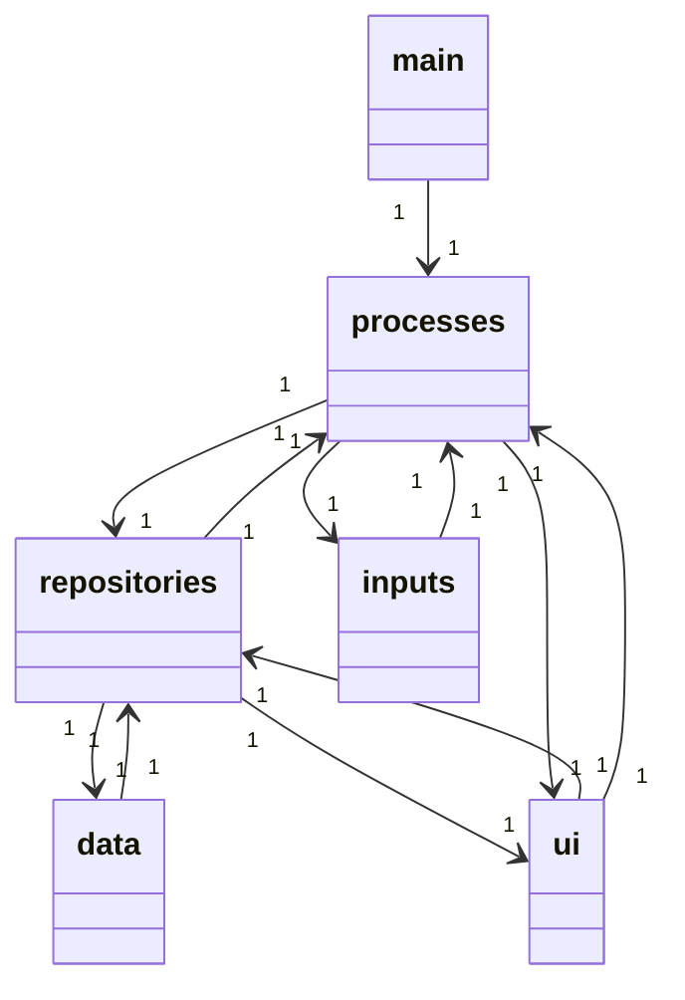
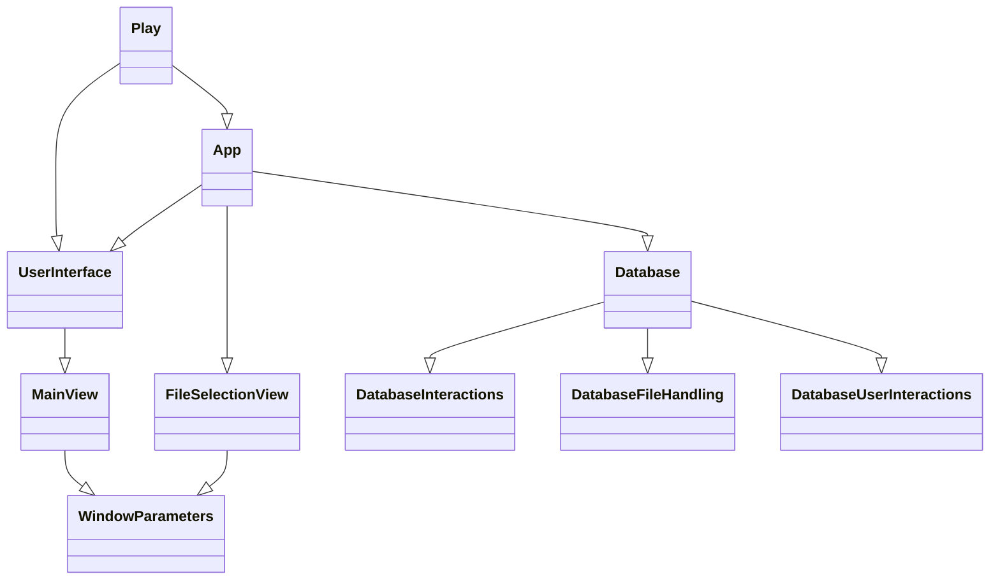
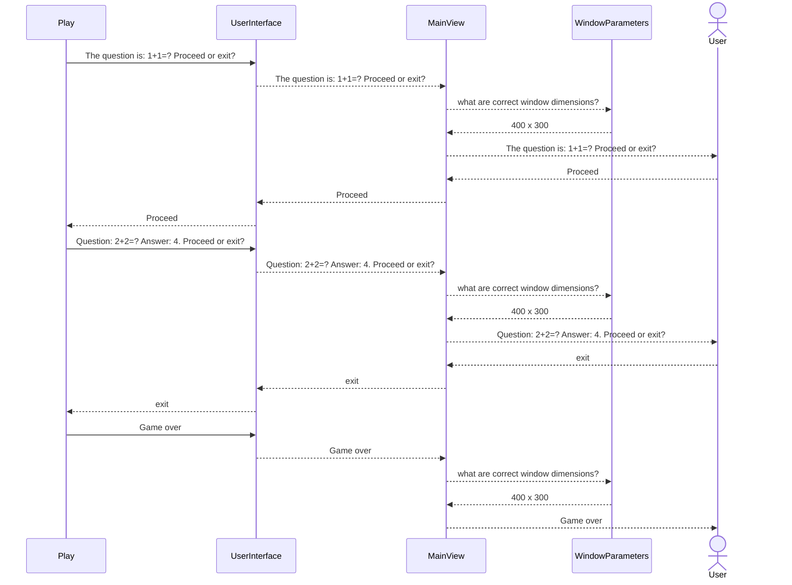

# Arkkitehtuurikuvaus

## Rakenne
Ohjelman rakenne on jäsennelty kahteen kerrokseen. Koodin pakkausrakenne on seuraavanlainen:

Pakkaus _ui_ sisältää käyttöliittymästä vastaavan koodin. Pakkaus _processes_ sisältää kaiken muun koodin joka vastaa sovelluslogiikasta,  suorituksesta, sekä tiedon pysyväistallennuksesta. Pakkaus _main_ sisältää ohjelman käynnistyskoodin joka on eriytetty omaksi skriptiksi _flashcards.py_. Pakkaus _repositories_ sisältää tietokantaa käsittelevän koodin. Pakkaus _data_ sisältää  pysyväistallennetun tiedon _.csv_ tai _sql_ muodossa. Pakkaus _inputs_ sisältää korttipakat eli syötetiedostot.

## Sovelluslogiikka
Sovelluksen rakenne modostuu seitsemästä luokasta: _Play_, _Database_, _DatabaseFileHandling_, _DatabaseInteractions_, _App_, _UserInterface_, _MainView_, _FileSelectionView_, _DatabaseUserInteractions_ ja _Window_parameters_. Luokat kuvaavat sovelluksen toiminnallisia kokonaisuuksia ja niiden keskinäiset suhteet voidaan kuvata luokkadiagrammin avulla: 
Luokkadiagrammi: 

Yksityiskohtaisempi versio missä näkyy myös luokkien attribuutit ja metodit löytyy [täältä](https://github.com/platipus82/ot-harjoitustyo/blob/main/dokumentaatio/class_diagram_detailed.MD). 

## Päätoiminnallisuudet
Päätoiminnallisuuksiin kuuluu korttipakan valinta sekä kysymysten kysyminen.

### Korttipakan valinta
Aluksi sovellus näyttää input-kansion tiedostot, joista käyttäjä voi valita sopivan syötetiedoston. Lisäksi käyttäjälle annetaan mahdollisuus valita toinen kansio tai muu tiedosto. 

### Kysymysten kysyminen
Kun syötetiedosto ja korttipakka on valittu, ohjelma käy läpi pakan kysymykset yksi kerrallaan. Kunkin kysymyksen kohdalla käyttäjä voi pyytää sovellusta näyttämään oikea vastaus valitsemalla painiketta _Proceed_, tai keskeyttää ohjelman suoritus klikkaamalla painiketta _Exit_.

Tämä prosessi voidaan havainnollistaa sekvenssidiagrammin avulla:

