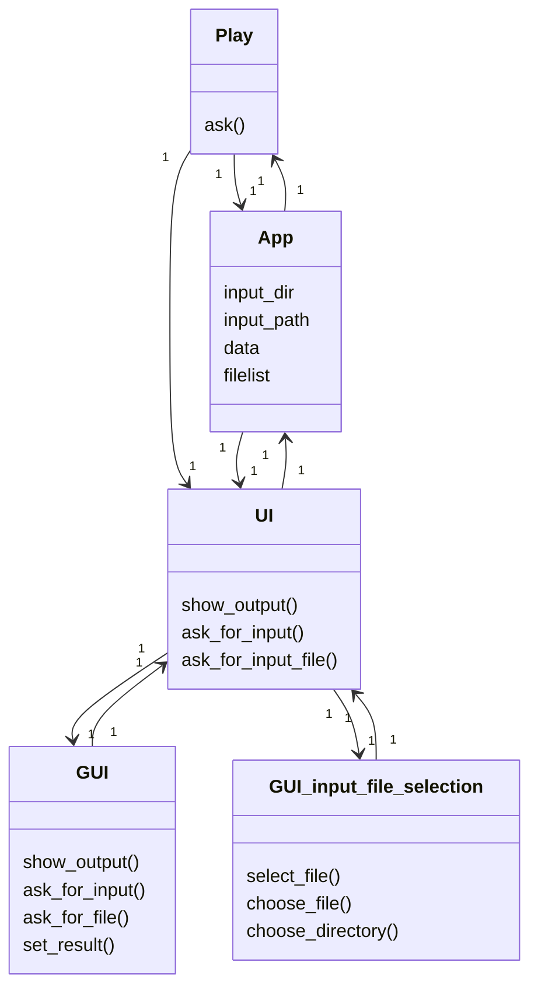
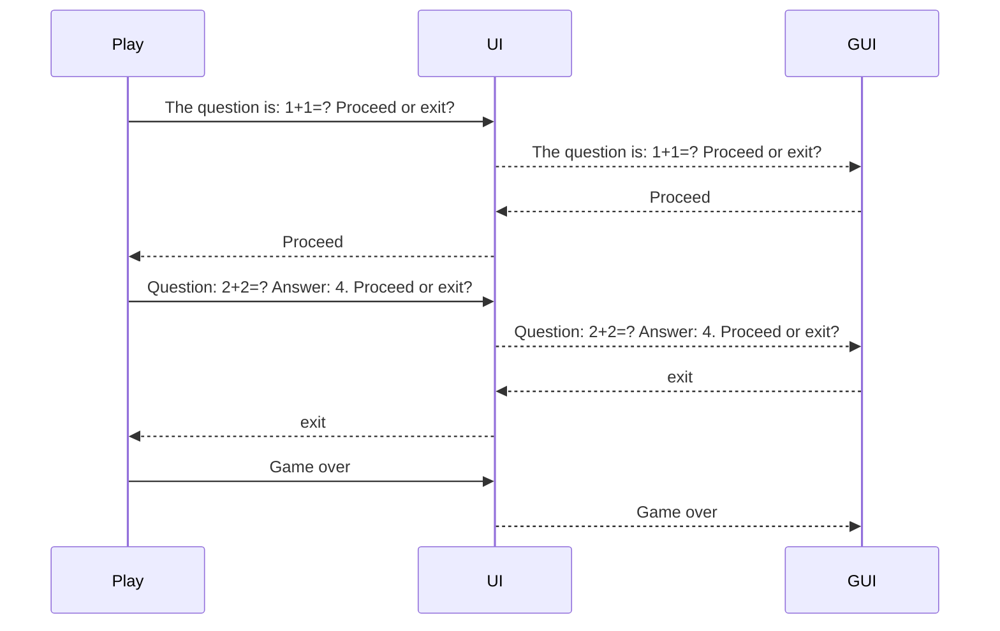

Luokkadiagrammi: 

# Päätoiminnallisuudet
Päätoiminnallisuuksiin kuuluu korttipakan valinta sekä kysymysten kysyminen.

## Korttipakan valinta
Aluksi sovellus näyttää input-kansion tiedostot, joista käyttäjä voi valita sopivan syötetiedoston. Lisäksi käyttäjälle annetaan mahdollisuus valita toinen kansio tai muu tiedosto. 

## Kysymysten kysyminen
Kun syötetiedosto ja korttipakka on valittu, ohjelma käy läpi pakan kysymykset yksi kerrallaan. Kunkin kysymyksen kohdalla käyttäjä voi pyytää sovellusta näyttämään oikea vastaus valitsemalla painiketta _Proceed_, tai keskeyttää ohjelman suoritus klikkaamalla painiketta _Exit_.

Tämä prosessi voidaan havainnollistaa sekvenssidiagrammin avulla:

