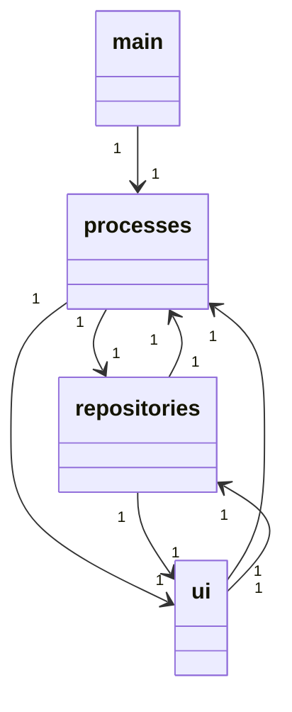
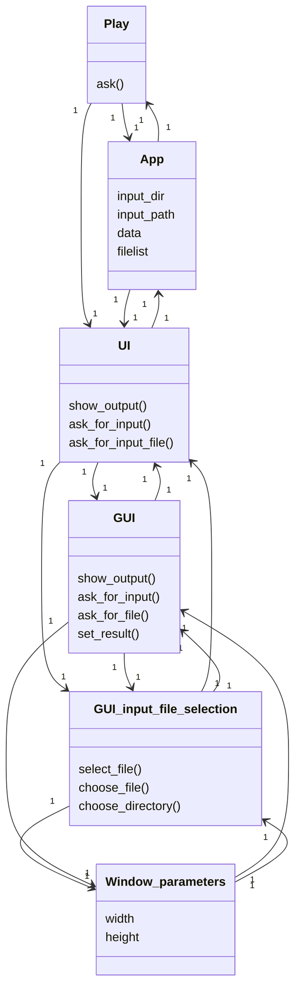
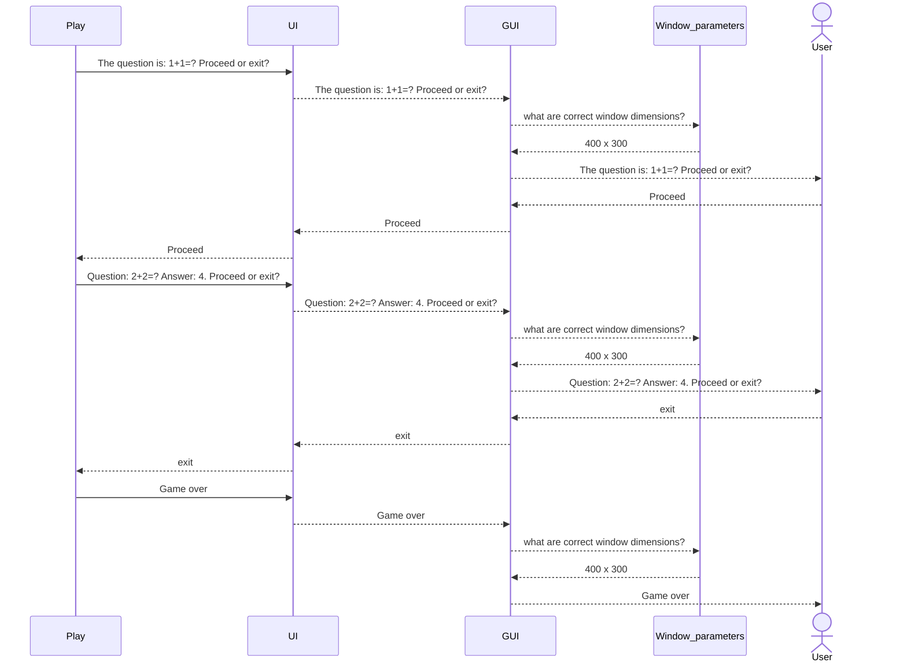

# Arkkitehtuurikuvaus

## Rakenne
Ohjelman rakenne on jäsennelty kahteen kerrokseen. Koodin pakkausrakenne on seuraavanlainen:

Pakkaus _ui_ sisältää käyttöliittymästä vastaavan koodin. Pakkaus _processes_ sisältää sovelluslogiikasta ja suorituksesta vastaavan koodin. Pakkaus _main_ sisältää ohjelman käynnistyskoodin joka on eriytetty omaksi skriptiksi _flashcards.py_. 

## Sovelluslogiikka
Sovelluksen rakenne modostuu kuudesta luokasta: _Play_, _App_, _UI_, _GUI_, _GUI_input_file_selection_ ja _Window_parameters_. Luokat kuvaavat sovelluksen toiminnallisia kokonaisuuksia ja niiden keskinäiset suhteet voidaan kuvata luokkadiagrammin avulla: 
Luokkadiagrammi: 

## Päätoiminnallisuudet
Päätoiminnallisuuksiin kuuluu korttipakan valinta sekä kysymysten kysyminen.

### Korttipakan valinta
Aluksi sovellus näyttää input-kansion tiedostot, joista käyttäjä voi valita sopivan syötetiedoston. Lisäksi käyttäjälle annetaan mahdollisuus valita toinen kansio tai muu tiedosto. 

### Kysymysten kysyminen
Kun syötetiedosto ja korttipakka on valittu, ohjelma käy läpi pakan kysymykset yksi kerrallaan. Kunkin kysymyksen kohdalla käyttäjä voi pyytää sovellusta näyttämään oikea vastaus valitsemalla painiketta _Proceed_, tai keskeyttää ohjelman suoritus klikkaamalla painiketta _Exit_.

Tämä prosessi voidaan havainnollistaa sekvenssidiagrammin avulla:

