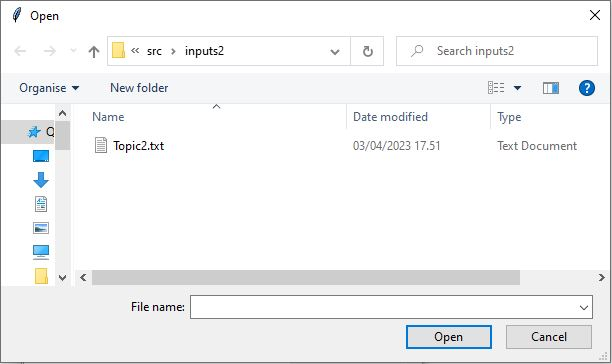
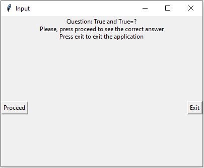
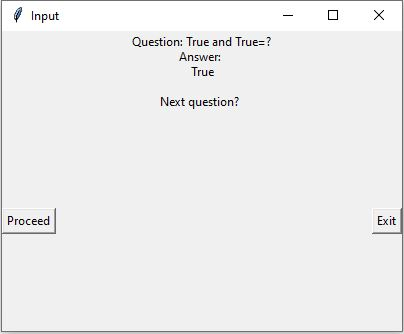

# Käyttöohje
## Asennus 
1. Ohjelman lataus. Lataa ohjelman viimeisin versio (_release_) [täältä](https://github.com/platipus82/ot-harjoitustyo/releases/tag/viikko6) haluamaasi kansioon.
2. Python-versio. Ohjelma on toteutettu ja testattu pythonin 3.8-versiolla. Yhteensopivuutta muiden python-versioiden kanssa ei ole testattu. Tarkista oma python-versio komennolla `python3 --version` tai `python --version` ja tarvittaessa päivitä se.
3. Riippuvuuksien asennus. Asenna riippuvuudet ohjelmahakemistoon komennolla `poetry install`

## Ohjelman käynnistäminen
1. Käynnistä sovellus komennolla `poetry run invoke start`
2. Vaihtoehtoisesti voit käynnistää sovellus komennoin `python3 flashcards.py`
3. ...tai `poetry run python src/flashcards.py` poetryn virtuaaliympäristössä

## Korttipakan valinta
1. Ensimmäisenä avautuu _korttipakan_ eli syötetiedoston valintanäkymä. Näkymässä näkyy _inputs_-kansiossa olevat korttipakat.
2. 
#

2a. Valitse haluamasi korttipakka klikkaamalla sen nimikettä ja painamalla _Select_
...tai 
2b. Valitse toinen tiedosto jostain toisesta kansiosta klikkaamalla _Choose another file_ ja valitsemalla avautuneesta valikosta haluamasi syötetiedosto.

#

## Kysymysten läpikäynti
1. Nyt olet valinnut korttipakan, ja ohjelma alkaa näyttää yksitellen siinä olevat kysymykset satunnaisessa järjestyksessä. 
2. 
#

2. Kunkin kysymyksen kohdalla voit vastata siihen haluamallasi tavalla ja jatkaa painamalla _Proceed_. Silloin sovellus näyttää oikean vastauksen. Voit myös keskeyttää klikkaamalla _Exit_

# 

3. Vastausruudussa voit valita _Proceed_ ja jatkaa ohjelman suoritusta seuraavaan kysymykseen, tai keskeyttää ohjelman suoritus valitsemalla _Exit_.
