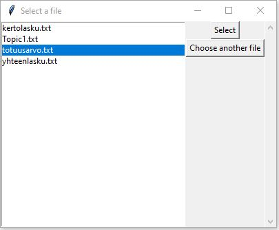

# Käyttöohje
## Asennus 
1. Ohjelman lataus. Lataa ohjelman viimeisin versio (_release_) [täältä](https://github.com/platipus82/ot-harjoitustyo/releases/tag/viikko5v4) haluamaasi kansioon.
2. Python-versio. Ohjelma on toteutettu ja testattu pythonin 3.8-versiolla. Yhteensopivuutta muiden python-versioiden kanssa ei ole testattu. Tarkista oma python-versio komennolla `python3 --version` tai `python --version` ja tarvittaessa päivitä se.
3. Riippuvuuksien asennus. Asenna riippuvuudet ohjelmahakemistoon komennolla `poetry install`

## Käyttö
1. Käynnistä sovellus komennolla `poetry run invoke start`
2. Ensimmäisenä avautuu _korttipakan_ eli syötetiedoston valintanäkymä 
3. #
