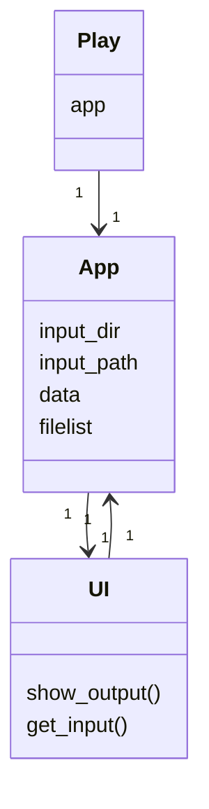

```mermaid
classDiagram
    Play "1" --> "1" App 
    App "1" --> "1" UI
    UI "1" --> "1" App
    class App{
        input_dir
        input_path 
        data
        filelist
    }
    class Play{
        app
    }
    class UI{
        show_output()
        get_input()
    }


```
