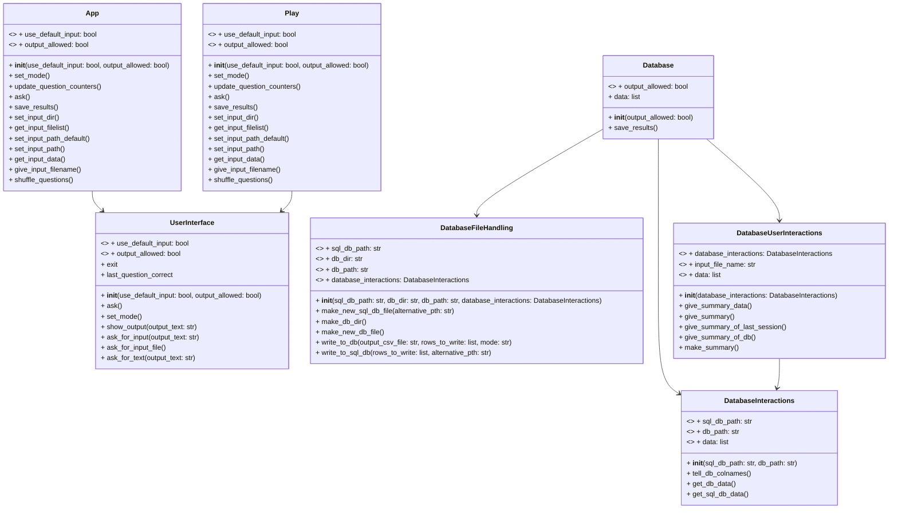

```mermaid
classDiagram
    class App {
        <<class>> + use_default_input: bool
        <<class>> + output_allowed: bool
        + __init__(use_default_input: bool, output_allowed: bool)
        + set_mode()
        + update_question_counters()
        + ask()
        + save_results()
        + set_input_dir()
        + get_input_filelist()
        + set_input_path_default()
        + set_input_path()
        + get_input_data()
        + give_input_filename()
        + shuffle_questions()
    }

    class Play {
        <<class>> + use_default_input: bool
        <<class>> + output_allowed: bool
        + __init__(use_default_input: bool, output_allowed: bool)
        + set_mode()
        + update_question_counters()
        + ask()
        + save_results()
        + set_input_dir()
        + get_input_filelist()
        + set_input_path_default()
        + set_input_path()
        + get_input_data()
        + give_input_filename()
        + shuffle_questions()
    }

    class UserInterface {
        <<class>> + use_default_input: bool
        <<class>> + output_allowed: bool
        + __init__(use_default_input: bool, output_allowed: bool)
        + ask()
        + set_mode()
        + exit
        + last_question_correct
        + show_output(output_text: str)
        + ask_for_input(output_text: str)
        + ask_for_input_file()
        + ask_for_text(output_text: str)
    }

    class Database {
        <<class>> + output_allowed: bool
        + __init__(output_allowed: bool)
        + save_results()
        + data: list
    }

    class DatabaseInteractions {
        <<class>> + sql_db_path: str
        <<class>> + db_path: str
        <<class>> + data: list
        + __init__(sql_db_path: str, db_path: str)
        + tell_db_colnames()
        + get_db_data()
        + get_sql_db_data()
    }

    class DatabaseFileHandling {
        <<class>> + sql_db_path: str
        <<class>> + db_dir: str
        <<class>> + db_path: str
        <<class>> + database_interactions: DatabaseInteractions
        + __init__(sql_db_path: str, db_dir: str, db_path: str, database_interactions: DatabaseInteractions)
        + make_new_sql_db_file(alternative_pth: str)
        + make_db_dir()
        + make_new_db_file()
        + write_to_db(output_csv_file: str, rows_to_write: list, mode: str)
        + write_to_sql_db(rows_to_write: list, alternative_pth: str)
    }

    class DatabaseUserInteractions {
        <<class>> + database_interactions: DatabaseInteractions
        <<class>> + input_file_name: str
        <<class>> + data: list
        + __init__(database_interactions: DatabaseInteractions)
        + give_summary_data()
        + give_summary()
        + give_summary_of_last_session()
        + give_summary_of_db()
        + make_summary()
    }

    App --> UserInterface
    Play --> UserInterface
    Database --> DatabaseInteractions
    Database --> DatabaseFileHandling
    Database --> DatabaseUserInteractions
    DatabaseUserInteractions --> DatabaseInteractions


```
