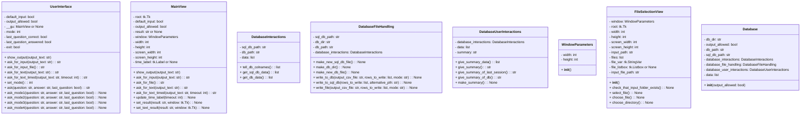

```mermaid
classDiagram
    class UserInterface {
        - default_input: bool
        - output_allowed: bool
        - __gu: MainView or None
        - mode: int
        - last_question_correct: bool
        - last_question_answered: bool
        - exit: bool
        + show_output(output_text: str)
        + ask_for_input(output_text: str) : str
        + ask_for_input_file() : str
        + ask_for_text(output_text: str) : str
        + ask_for_text_timed(output_text: str, timeout: int) : str
        + set_mode() : int
        + ask(question: str, answer: str, last_question: bool) : str
        + ask_mode1(question: str, answer: str, last_question: bool) : None
        + ask_mode2(question: str, answer: str, last_question: bool) : None
        + ask_mode3(question: str, answer: str, last_question: bool) : None
        + ask_mode4(question: str, answer: str, last_question: bool) : None
    }

    class MainView {
        - root: tk.Tk
        - default_input: bool
        - output_allowed: bool
        - result: str or None
        - window: WindowParameters
        - width: int
        - height: int
        - screen_width: int
        - screen_height: int
        - time_label: tk.Label or None
        + show_output(output_text: str)
        + ask_for_input(output_text: str) : str
        + ask_for_file() : str
        + ask_for_text(output_text: str) : str
        + ask_for_text_timed(output_text: str, timeout: int) : str
        + update_time_label(timeout: int) : None
        + set_result(result: str, window: tk.Tk) : None
        + set_text_result(result: str, window: tk.Tk) : None
    }

    class DatabaseInteractions {
        - sql_db_path: str
        - db_path: str
        - data: list
        + tell_db_colnames() : list
        + get_sql_db_data() : list
        + get_db_data() : list
    }

    class DatabaseFileHandling {
        - sql_db_path: str
        - db_dir: str
        - db_path: str
        - database_interactions: DatabaseInteractions
        + make_new_sql_db_file() : None
        + make_db_dir() : None
        + make_new_db_file() : None
        + write_to_db(output_csv_file: str, rows_to_write: list, mode: str) : None
        + write_to_sql_db(rows_to_write: list, alternative_pth: str) : None
        + write_file(output_csv_file: str, rows_to_write: list, mode: str) : None
    }

    class DatabaseUserInteractions {
        - database_interactions: DatabaseInteractions
        - data: list
        - summary: str
        + give_summary_data() : list
        + give_summary() : str
        + give_summary_of_last_session() : str
        + give_summary_of_db() : str
        + make_summary() : None
    }

    class WindowParameters {
        - width: int
        - height: int
        + __init__()
    }

    class FileSelectionView {
        - window: WindowParameters
        - root: tk.Tk
        - width: int
        - height: int
        - screen_width: int
        - screen_height: int
        - input_path: str
        - files: list
        - file_var: tk.StringVar
        - file_listbox: tk.Listbox or None
        - input_file_path: str
        + __init__()
        + check_that_input_folder_exists() : None
        + select_file() : None
        + choose_file() : None
        + choose_directory() : None
    }

    class Database {
        - db_dir: str
        - output_allowed: bool
        - db_path: str
        - sql_db_path: str
        - database_interactions: DatabaseInteractions
        - database_file_handling: DatabaseFileHandling
        - database_user_interactions: DatabaseUserInteractions
        - data: list
        + __init__(output_allowed: bool)
    }
```
