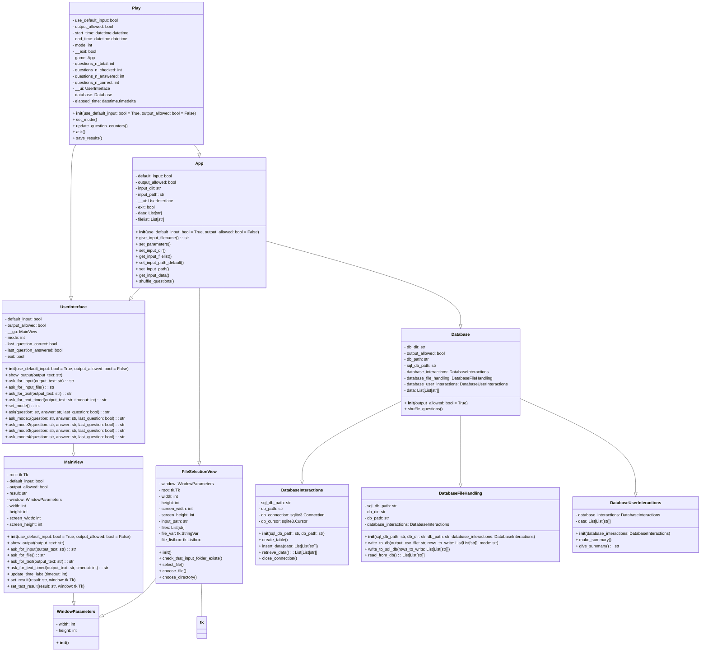

```mermaid
classDiagram
    class UserInterface
    class MainView
    class DatabaseInteractions
    class DatabaseFileHandling
    class DatabaseUserInteractions
    class WindowParameters
    class FileSelectionView
    class Database
    class App
    class Play

    class UserInterface {
        - default_input: bool
        - output_allowed: bool
        - __gu: MainView
        - mode: int
        - last_question_correct: bool
        - last_question_answered: bool
        - exit: bool
        + __init__(use_default_input: bool = True, output_allowed: bool = False)
        + show_output(output_text: str)
        + ask_for_input(output_text: str) : str
        + ask_for_input_file() : str
        + ask_for_text(output_text: str) : str
        + ask_for_text_timed(output_text: str, timeout: int) : str
        + set_mode() : int
        + ask(question: str, answer: str, last_question: bool) : str
        + ask_mode1(question: str, answer: str, last_question: bool) : str
        + ask_mode2(question: str, answer: str, last_question: bool) : str
        + ask_mode3(question: str, answer: str, last_question: bool) : str
        + ask_mode4(question: str, answer: str, last_question: bool) : str
    }

    class MainView {
        - root: tk.Tk
        - default_input: bool
        - output_allowed: bool
        - result: str
        - window: WindowParameters
        - width: int
        - height: int
        - screen_width: int
        - screen_height: int
        + __init__(use_default_input: bool = True, output_allowed: bool = False)
        + show_output(output_text: str)
        + ask_for_input(output_text: str) : str
        + ask_for_file() : str
        + ask_for_text(output_text: str) : str
        + ask_for_text_timed(output_text: str, timeout: int) : str
        + update_time_label(timeout: int)
        + set_result(result: str, window: tk.Tk)
        + set_text_result(result: str, window: tk.Tk)
    }

    class DatabaseInteractions {
        - sql_db_path: str
        - db_path: str
        - db_connection: sqlite3.Connection
        - db_cursor: sqlite3.Cursor
        + __init__(sql_db_path: str, db_path: str)
        + create_table()
        + insert_data(data: List[List[str]])
        + retrieve_data() : List[List[str]]
        + close_connection()
    }

    class DatabaseFileHandling {
        - sql_db_path: str
        - db_dir: str
        - db_path: str
        - database_interactions: DatabaseInteractions
        + __init__(sql_db_path: str, db_dir: str, db_path: str, database_interactions: DatabaseInteractions)
        + write_to_db(output_csv_file: str, rows_to_write: List[List[str]], mode: str)
        + write_to_sql_db(rows_to_write: List[List[str]])
        + read_from_db() : List[List[str]]
    }

    class DatabaseUserInteractions {
        - database_interactions: DatabaseInteractions
        - data: List[List[str]]
        + __init__(database_interactions: DatabaseInteractions)
        + make_summary()
        + give_summary() : str
    }

    class WindowParameters {
        - width: int
        - height: int
        + __init__()
    }

    class FileSelectionView {
        - window: WindowParameters
        - root: tk.Tk
        - width: int
        - height: int
        - screen_width: int
        - screen_height: int
        - input_path: str
        - files: List[str]
        - file_var: tk.StringVar
        - file_listbox: tk.Listbox
        + __init__()
        + check_that_input_folder_exists()
        + select_file()
        + choose_file()
        + choose_directory()
    }

    class Database {
        - db_dir: str
        - output_allowed: bool
        - db_path: str
        - sql_db_path: str
        - database_interactions: DatabaseInteractions
        - database_file_handling: DatabaseFileHandling
        - database_user_interactions: DatabaseUserInteractions
        - data: List[List[str]]
        + __init__(output_allowed: bool = True)
        + shuffle_questions()
    }

    class App {
        - default_input: bool
        - output_allowed: bool
        - input_dir: str
        - input_path: str
        - __ui: UserInterface
        - exit: bool
        - data: List[str]
        - filelist: List[str]
        + __init__(use_default_input: bool = True, output_allowed: bool = False)
        + give_input_filename() : str
        + set_parameters()
        + set_input_dir()
        + get_input_filelist()
        + set_input_path_default()
        + set_input_path()
        + get_input_data()
        + shuffle_questions()
    }

    class Play {
        - use_default_input: bool
        - output_allowed: bool
        - start_time: datetime.datetime
        - end_time: datetime.datetime
        - mode: int
        - __exit: bool
        - game: App
        - questions_n_total: int
        - questions_n_checked: int
        - questions_n_answered: int
        - questions_n_correct: int
        - __ui: UserInterface
        - database: Database
        - elapsed_time: datetime.timedelta
        + __init__(use_default_input: bool = True, output_allowed: bool = False)
        + set_mode()
        + update_question_counters()
        + ask()
        + save_results()
    }

    UserInterface --|> MainView
    MainView --|> WindowParameters
    FileSelectionView --|> WindowParameters
    FileSelectionView -- tk
    Database --|> DatabaseInteractions
    Database --|> DatabaseFileHandling
    Database --|> DatabaseUserInteractions
    App --|> UserInterface
    App --|> FileSelectionView
    Play --|> UserInterface
    App --|> Database
    Play --|> App
```
