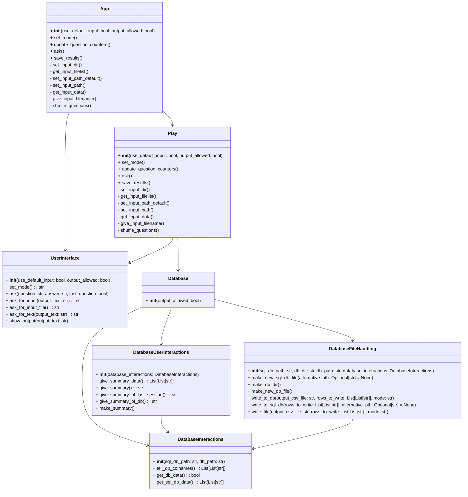

```mermaid
classDiagram
    class App {
        + __init__(use_default_input: bool, output_allowed: bool)
        + set_mode()
        + update_question_counters()
        + ask()
        + save_results()
        - set_input_dir()
        - get_input_filelist()
        - set_input_path_default()
        - set_input_path()
        - get_input_data()
        - give_input_filename()
        - shuffle_questions()
    }

    class Play {
        + __init__(use_default_input: bool, output_allowed: bool)
        + set_mode()
        + update_question_counters()
        + ask()
        + save_results()
        - set_input_dir()
        - get_input_filelist()
        - set_input_path_default()
        - set_input_path()
        - get_input_data()
        - give_input_filename()
        - shuffle_questions()
    }

    class UserInterface {
        + __init__(use_default_input: bool, output_allowed: bool)
        + set_mode() : str
        + ask(question: str, answer: str, last_question: bool)
        + ask_for_input(output_text: str) : str
        + ask_for_input_file() : str
        + ask_for_text(output_text: str) : str
        + show_output(output_text: str)
    }

    class Database {
        + __init__(output_allowed: bool)
    }

    class DatabaseInteractions {
        + __init__(sql_db_path: str, db_path: str)
        + tell_db_colnames() : List[List[str]]
        + get_db_data() : bool
        + get_sql_db_data() : List[List[str]]
    }

    class DatabaseFileHandling {
        + __init__(sql_db_path: str, db_dir: str, db_path: str, database_interactions: DatabaseInteractions)
        + make_new_sql_db_file(alternative_pth: Optional[str] = None)
        + make_db_dir()
        + make_new_db_file()
        + write_to_db(output_csv_file: str, rows_to_write: List[List[str]], mode: str)
        + write_to_sql_db(rows_to_write: List[List[str]], alternative_pth: Optional[str] = None)
        + write_file(output_csv_file: str, rows_to_write: List[List[str]], mode: str)
    }

    class DatabaseUserInteractions {
        + __init__(database_interactions: DatabaseInteractions)
        + give_summary_data() : List[List[str]]
        + give_summary() : str
        + give_summary_of_last_session() : str
        + give_summary_of_db() : str
        + make_summary()
    }

    App --> UserInterface
    App --> Play
    Play --> UserInterface
    Play --> Database
    Database --> DatabaseInteractions
    Database --> DatabaseFileHandling
    Database --> DatabaseUserInteractions
    DatabaseUserInteractions --> DatabaseInteractions
    DatabaseFileHandling --> DatabaseInteractions
```
