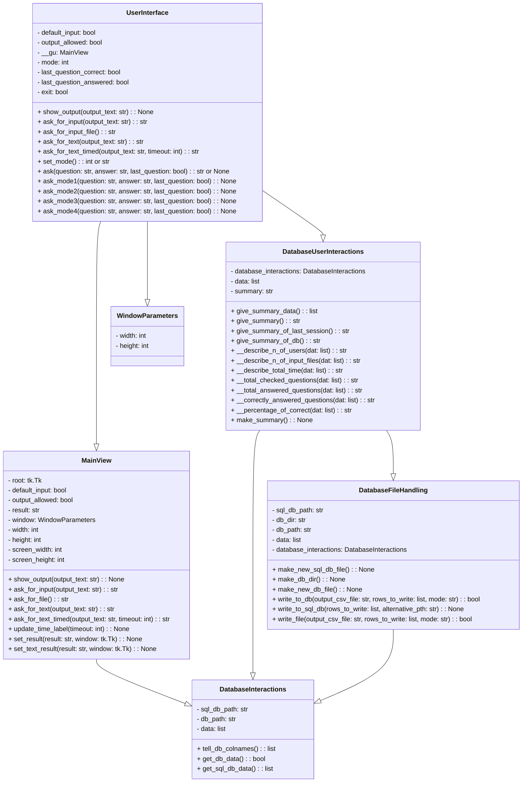

```mermaid
classDiagram
    class UserInterface {
        - default_input: bool
        - output_allowed: bool
        - __gu: MainView
        - mode: int
        - last_question_correct: bool
        - last_question_answered: bool
        - exit: bool
        + show_output(output_text: str): None
        + ask_for_input(output_text: str): str
        + ask_for_input_file(): str
        + ask_for_text(output_text: str): str
        + ask_for_text_timed(output_text: str, timeout: int): str
        + set_mode(): int or str
        + ask(question: str, answer: str, last_question: bool): str or None
        + ask_mode1(question: str, answer: str, last_question: bool): None
        + ask_mode2(question: str, answer: str, last_question: bool): None
        + ask_mode3(question: str, answer: str, last_question: bool): None
        + ask_mode4(question: str, answer: str, last_question: bool): None
    }

    class MainView {
        - root: tk.Tk
        - default_input: bool
        - output_allowed: bool
        - result: str
        - window: WindowParameters
        - width: int
        - height: int
        - screen_width: int
        - screen_height: int
        + show_output(output_text: str): None
        + ask_for_input(output_text: str): str
        + ask_for_file(): str
        + ask_for_text(output_text: str): str
        + ask_for_text_timed(output_text: str, timeout: int): str
        + update_time_label(timeout: int): None
        + set_result(result: str, window: tk.Tk): None
        + set_text_result(result: str, window: tk.Tk): None
    }

    class DatabaseUserInteractions {
        - database_interactions: DatabaseInteractions
        - data: list
        - summary: str
        + give_summary_data(): list
        + give_summary(): str
        + give_summary_of_last_session(): str
        + give_summary_of_db(): str
        + __describe_n_of_users(dat: list): str
        + __describe_n_of_input_files(dat: list): str
        + __describe_total_time(dat: list): str
        + __total_checked_questions(dat: list): str
        + __total_answered_questions(dat: list): str
        + __correctly_answered_questions(dat: list): str
        + __percentage_of_correct(dat: list): str
        + make_summary(): None
    }

    class DatabaseInteractions {
        - sql_db_path: str
        - db_path: str
        - data: list
        + tell_db_colnames(): list
        + get_db_data(): bool
        + get_sql_db_data(): list
    }

    class DatabaseFileHandling {
        - sql_db_path: str
        - db_dir: str
        - db_path: str
        - data: list
        - database_interactions: DatabaseInteractions
        + make_new_sql_db_file(): None
        + make_db_dir(): None
        + make_new_db_file(): None
        + write_to_db(output_csv_file: str, rows_to_write: list, mode: str): bool
        + write_to_sql_db(rows_to_write: list, alternative_pth: str): None
        + write_file(output_csv_file: str, rows_to_write: list, mode: str): bool
    }

    class WindowParameters {
        - width: int
        - height: int
    }

    UserInterface --|> MainView
    UserInterface --|> DatabaseUserInteractions
    MainView --|> DatabaseInteractions
    DatabaseUserInteractions --|> DatabaseInteractions
    DatabaseFileHandling --|> DatabaseInteractions
    DatabaseUserInteractions --|> DatabaseFileHandling
    UserInterface --|> WindowParameters
```
