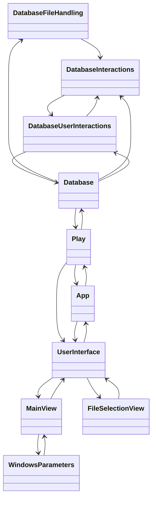

```mermaid
classDiagram
    class DatabaseFileHandling{
    }
    class DatabaseInteractions{
    }
    class DatabaseUserInteractions{
    }
    class Database{
    }
    class App{
    }
    class Play{
    }
    class UserInterface{
    }
    class MainView{
    }  
    class FileSelectionView{
    }   
    class WindowsParameters{
    }   
    class DatabaseUserInteractions{
    }   


    DatabaseFileHandling --> DatabaseInteractions
    DatabaseInteractions --> DatabaseUserInteractions
    Database --> DatabaseFileHandling
    Database --> DatabaseInteractions
    Database --> DatabaseUserInteractions
    DatabaseUserInteractions --> DatabaseInteractions
    DatabaseUserInteractions --> Database

    Play --> Database 
    Database --> Play
    Play --> App 
    Play --> UserInterface 
    App --> UserInterface
    App --> Play
    UserInterface --> App
    UserInterface --> MainView
    WindowsParameters --> MainView
    MainView --> WindowsParameters
    UserInterface --> FileSelectionView
    FileSelectionView --> UserInterface
    MainView --> UserInterface
```
