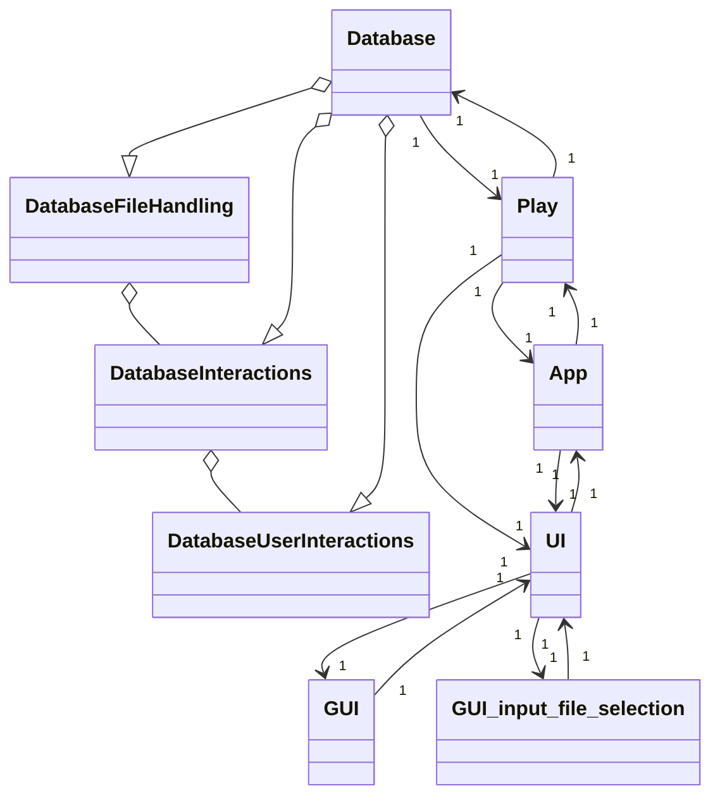

```mermaid
classDiagram
    class DatabaseFileHandling{
    }
    class DatabaseInteractions{
    }
    class DatabaseUserInteractions{
    }
    class Database{
    }
    class App{
    }
    class Play{
    }
    class UI{
    }
    class GUI{
    }  
    class GUI_input_file_selection{
    }   


    DatabaseFileHandling o-- DatabaseInteractions
    DatabaseInteractions o-- DatabaseUserInteractions
    Database o--|> DatabaseFileHandling
    Database o--|> DatabaseInteractions
    Database o--|> DatabaseUserInteractions

    Play "1" --> "1" Database 
    Database "1" --> "1" Play
    Play "1" --> "1" App 
    Play "1" --> "1" UI 
    App "1" --> "1" UI
    App "1" --> "1" Play
    UI "1" --> "1" App
    UI "1" --> "1" GUI
    UI "1" --> "1" GUI_input_file_selection
    GUI_input_file_selection "1" --> "1" UI
    GUI "1" --> "1" UI
```
