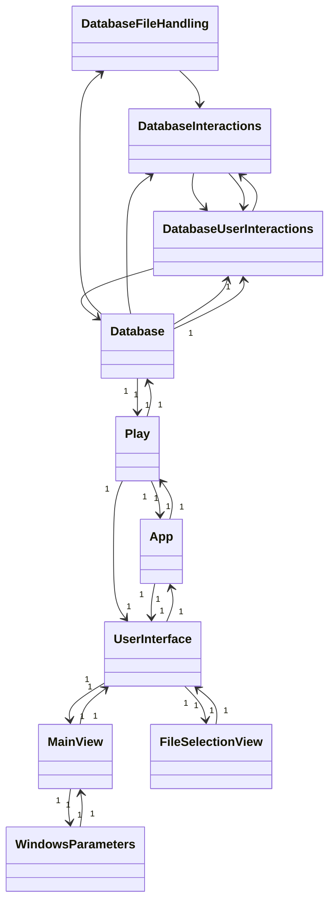

```mermaid
classDiagram
    class DatabaseFileHandling{
    }
    class DatabaseInteractions{
    }
    class DatabaseUserInteractions{
    }
    class Database{
    }
    class App{
    }
    class Play{
    }
    class UserInterface{
    }
    class MainView{
    }  
    class FileSelectionView{
    }   
    class WindowsParameters{
    }   
    class DatabaseUserInteractions{
    }   


    DatabaseFileHandling --> DatabaseInteractions
    DatabaseInteractions --> DatabaseUserInteractions
    Database --> DatabaseFileHandling
    Database --> DatabaseInteractions
    Database --> DatabaseUserInteractions
    DatabaseInteractions --> DatabaseUserInteractions
    DatabaseUserInteractions --> DatabaseInteractions
    DatabaseUserInteractions --> Database

    Play "1" --> "1" Database 
    Database "1" --> "1" Play
    Database "1" --> "1" DatabaseUserInteractions
    Play "1" --> "1" App 
    Play "1" --> "1" UserInterface 
    App "1" --> "1" UserInterface
    App "1" --> "1" Play
    UserInterface "1" --> "1" App
    UserInterface "1" --> "1" MainView
    WindowsParameters "1" --> "1" MainView
    MainView "1" --> "1" WindowsParameters
    UserInterface "1" --> "1" FileSelectionView
    FileSelectionView "1" --> "1" UserInterface
    MainView "1" --> "1" UserInterface
```
