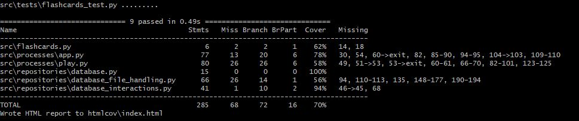

# Testausdokumentti

## Yksikkö- ja integraatiotestaus
### Sovelluslogiikka
### Repositories

### Testikattavuus
Käyttöliittymäkerrosta ei ole testattu. Muuilta osin sovelluksen testauksen haarautumakattavuus on 71%

## Järjestelmätestaus
### Asennus 
Viimeisin sovellusversio on haettu ja sitä on testattu käyttöohjeen kuvaamalla tavalla Windows- ja Linux-ympäristössä.
Sovellusta on testattu tilanteissa joissa
- käyttäjä on uusi tai entuudestaan tuttu
- syötetiedostostot ovat olemassa tai puuttuvat
- tietokantatiedostot ovat olemassa tai puuttuvat
- kaikilla käyttömoodeilla, mukaan lukien ajastettu läpikäynti
- oikeilla, virheellisillä ja puuttuvilla vastauksilla ja syötteillä

Käyttäjäyhteenvedon oikeellisuudet on myös tarkistettu. 

### Toiminnallisuudet
Kaikki vaatimusmäärittelydokumentin mukaiset toiminnallisuudet on testattu ja ne toimii.

## Sovelluksen laatuongelmat
Sovellus ei kaikissa tilanteissa anna järkeviä virheilmoituksia. Toisaalta se ei myöskään kaadu virheellisillä syötteillä vaan kysyy tietoja uudelleen kunnes validi syöte on annettu. 
