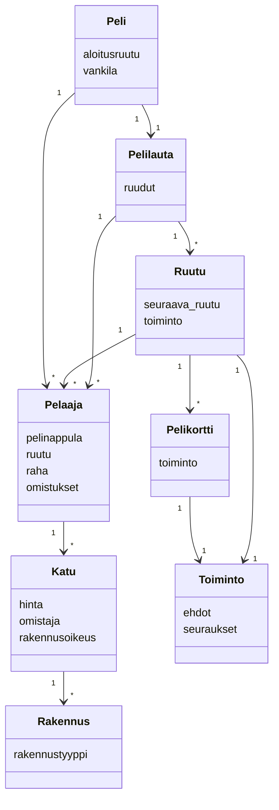

```mermaid
classDiagram
    Pelilauta "1" --> "*" Pelaaja 
    Pelilauta "1" --> "*" Ruutu
    Ruutu "1" --> "*" Pelaaja
    Peli "1" --> "1" Pelilauta
    Peli "1" --> "*" Pelaaja
    Pelaaja "1" --> "*" Katu
    Ruutu "1" --> "1" Toiminto
    Ruutu "1" --> "*" Pelikortti
    Pelikortti "1" --> "1" Toiminto
    Katu "1" --> "*" Rakennus
    class Peli{
        aloitusruutu
        vankila
    }
    class Ruutu{
        seuraava_ruutu
        toiminto
    }
    class Katu{
        hinta
        omistaja
        rakennusoikeus
    }

    class Pelaaja{
        pelinappula
        ruutu
        raha
        omistukset
    }

    class Pelilauta{
        ruudut
    }

    class Pelikortti{
        toiminto
    }  

    class Toiminto{
        ehdot
        seuraukset
    }

    class Rakennus{
        rakennustyyppi
    }

```
