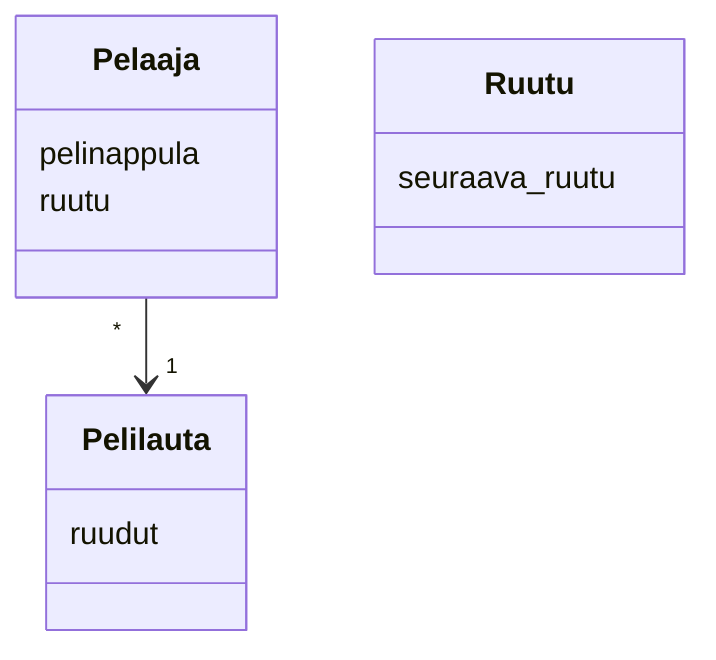

```mermaid
classDiagram
    Pelaaja "*" --> "1" Pelilauta

    class Ruutu{
        seuraava_ruutu
    }

    class Pelaaja{
        pelinappula
        ruutu
    }

    class Pelilauta{
        ruudut
    }

  


```
